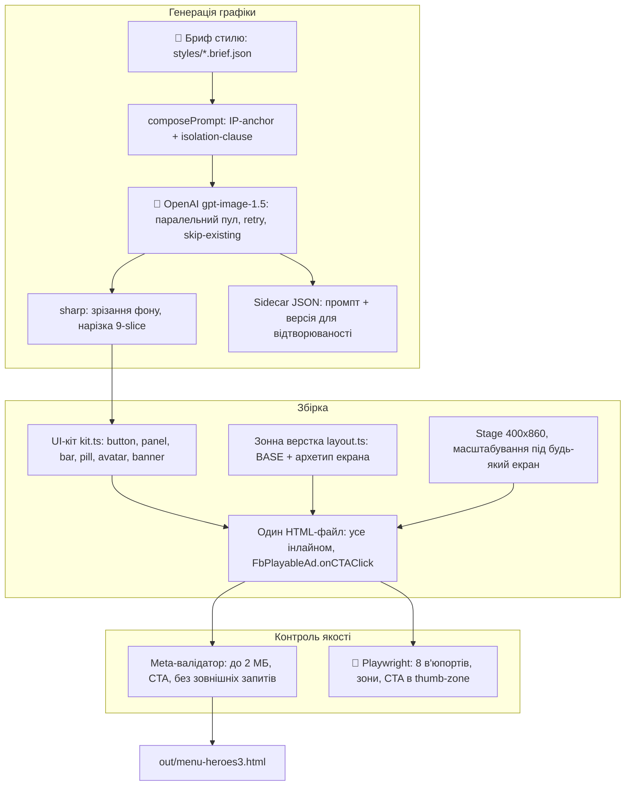

# playable-forge

CLI-конвеєр для збірки Meta playable ads: шаблон механіки × стиль × бриф → один HTML-файл до 2 МБ.

> **TL;DR (EN):** CLI toolchain that builds Meta playable ads from templates × styles × briefs: an OpenAI image-generation pipeline, a 9-slice PixiJS UI kit, zone-based layouts, Playwright visual regression across 8 viewports, and a validator that ships everything as a single HTML file under Meta's 2 MB limit.

## Що це таке, простими словами?

Playable ad — це реклама, в яку можна пограти: пів хвилини міні-гри прямо в стрічці Facebook чи Instagram, а в кінці — кнопка «Install». Уяви ательє з пошиття костюмів: є лекала *(шаблони — готові ігрові механіки: меню, «з'єднай точки», «тапни по цілі»)*, є тканина *(стиль — JSON-файл, який каже «малюй у дусі Heroes III» або «як 16-бітна гра з дев'яностих»)*, і є замовлення клієнта *(бриф)*. playable-forge — це таке ательє, тільки замість кравця — конвеєр: він сам замовляє нейромережі всі «тканини й ґудзики» — кнопки, панелі, героїв, стрічки-банери, — сам розкроює їх на деталі інтерфейсу, розставляє по екрану так, щоб головна кнопка завжди опинялася під великим пальцем, і пакує все в один HTML-файл, легший за два фото з телефона. Наприкінці роботу приймає ВТК: скрипт фотографує результат на восьми розмірах екранів *(через Playwright — інструмент, що керує браузером як робот)* і перевіряє, що ніде нічого не вилізло за межі.

> **Дисклеймер.** Усі графічні асети в проєкті згенеровані AI (OpenAI `gpt-image-1.5`). Назви ігор у стильових брифах — Heroes III, Diablo II — це лише текстові стильові референси в промптах («намалюй у такому дусі»); жодні оригінальні матеріали, спрайти чи арт цих ігор не використовувалися. Репозиторій некомерційний, зібраний як портфоліо-проєкт.

## Як це працює



## Можливості

- **Генерація асетів із версіонованих брифів** — 16 стильових брифів (`styles/*.brief.json`, схема `src/assetgen/brief.schema.json`). До кожної картинки пишеться sidecar-JSON із промптом і версією — будь-який асет можна перегенерувати відтворювано.
- **Вартість під контролем** — $0.24–$1.13 за playable залежно від якості брифу; пул генерації враховує ліміт OpenAI 5 зображень/хв і пропускає вже згенеровані асети.
- **UI-кіт з одним джерелом правди** (`src/assetgen/kit/kit.ts`) — шість 9-slice компонентів (`button / panel / bar / pill / avatar / banner`), вбудований шрифт, три рівні кнопок (`primary / default / tertiary`) — одна головна дія на екран.
- **Зонна верстка** (`src/assetgen/kit/layout.ts`) — універсальний `BASE` (safe-зони, тач-таргети від 44px, CTA у thumb-zone) поєднується з архетипами екранів (`menu / pick-hero / endcard`); елементи ставляться за зонами (`zone("actions", …)`), не координатами. Debug-оверлей: `?zones=1`.
- **Візуальні регресійні тести** (`npm run visual`) — Playwright-скриншоти у 8 в'юпортах (портретні телефони, планшет, ландшафт, квадрат); перевіряється відсутність overflow, що кожен елемент у своїй зоні і що головна CTA — в досяжності великого пальця.
- **Meta-валідатор** — один файл до 2 МБ, обов'язковий `FbPlayableAd.onCTAClick()`, без редіректів і зовнішніх завантажень.
- **Два стилі зібрані наскрізно** — `heroes3` (пейнтерлі) та `pixelart` (16-біт); обидва проходять усі перевірки в'юпортів і зон (`npm run visual` → `ALL PASS`).
- **Лабораторія промптів** — `prompt-lab` для A/B-порівняння промпт-стратегій, `ref-test` для консистентності персонажів через `images.edit` з майстер-референсом.

## Чому це цікаво технічно

- **Обмеження в 2 МБ визначає архітектуру.** Усе інлайниться в один HTML, а base64 додає ~33% ваги — звідси 9-slice (одна маленька текстура тягне кнопку будь-якого розміру), прозорі PNG з нативної генерації та зрізання фону через sharp з фолбеком.
- **Верстка перевіряється як інваріант, а не «на око».** Зонні правила з `layout.ts` — це ті самі дані, які потім assert-ить Playwright: тест падає, якщо елемент вийшов із зони або CTA покинула thumb-zone на будь-якому з 8 в'юпортів.
- **Позиція тексту на банері обчислюється, не підбирається.** «Писабельна» смуга стрічки міряється через центроїд у sharp — тайтл сідає на неї автоматично для будь-якого згенерованого банера.
- **Вибір моделі — компроміс, зафіксований у правилах.** `gpt-image-1.5` замість `gpt-image-2`: нативний прозорий PNG і в 3–4 рази швидша генерація за прийнятної якості.
- **Екрани збираються з валідованих шарів даних** (див. [`docs/KIT.md`](docs/KIT.md)): *Catalog* (що це за компонент) → *Groups* (семантичні сім'ї, `validateRecipe`) → *Zones* (де на екрані) → *Flow* (як екрани з'єднані, `validateFlow`) → *Scene* (настрій фону: `world / focus / celebration`). Кожен шар має власну валідацію.

## Як запустити

Потрібен Node.js (проєкт на ESM + `tsx`, запускається без окремого кроку компіляції).

```bash
git clone https://github.com/SerhiiDubei/playableads.git
cd playableads
npm install
cp .env.example .env    # додай OPENAI_API_KEY — потрібен для генерації графіки
```

Основні команди (з `package.json`):

```bash
npm run playable -- list             # список механік і стилів
npm run playable -- menu heroes3     # зібрати playable -> out/menu-heroes3.html (з валідацією)
npm run playable -- menu pixelart    # 16-бітний варіант
npm run menu                         # тестовий playable на 10 екранів (heroes3)
npm run experiments                  # 5 арт-дирекшн розкладок на одній зонній системі
npm run recipes                      # екрани, зібрані лише з рецептів group@zone
npm run game                         # інтерактивний playable tap-to-attack
npm run connect                      # гра drag-to-connect: 3 рівні, фонові сцени
npm run components                   # вітрина компонентів UI-кіта
npm run catalog                      # перегенерувати docs/KIT.md
npm run visual                       # візуальна регресія по 8 в'юпортах
npm run check:layouts -- all         # лінт розкладок (потрібно 7/7 PASS)
npm run typecheck
npm run test
```

Для `npm run visual` потрібні браузери Playwright: `npx playwright install chromium`.

Повний прогін одного стилю з генерацією і звітом: `npm run forge -- <style> [--layout <id>]` — фаза 1 (AI-асети) + фаза 2 (HTML) + репорт.

## Стан проекту

Версія 0.1.0, 119 комітів. Це дослідницький репозиторій: частина коду — стабільний конвеєр, частина — лабораторія.

**Працює:**
- Два стилі наскрізно (`heroes3`, `pixelart`): генерація → збірка → валідація → всі перевірки в'юпортів і зон зелені.
- Збірка одного HTML-файла з Meta-валідацією, зонна верстка, UI-кіт, візуальні тести.
- Відтворюваність асетів через sidecar-JSON.

**Прототипи та лабораторія:**
- `templates/` — за власним стандартом репо сюди мають потрапляти лише «промоутнуті» ігри; наявні папки створені до появи стандарту і фактично ще належать до `labs/`.
- `styles/` містить 38 файлів — крім 16 брифів, це робочі чернетки клієнтських концептів різного ступеня готовності.
- `pipeline:*`, `studio` (веб-сервер), `dashboard` — експериментальні гілки.

**Чого нема:**
- Пакета в npm — запуск лише з клона через `tsx` (`build:cli` через esbuild є, але дистрибуція не налаштована).
- Автотестів ігрової логіки поза візуальними перевірками.
- CI-деплою готових playable.

Інженерні правила й інсайти — у [`CLAUDE.md`](CLAUDE.md); журнал експериментів — у [`test/EXPERIMENT-LOG.md`](test/EXPERIMENT-LOG.md); сесійні логи — в [`docs/`](docs/). Згенеровані файли (`out/`) і секрети (`.env`) не комітяться.